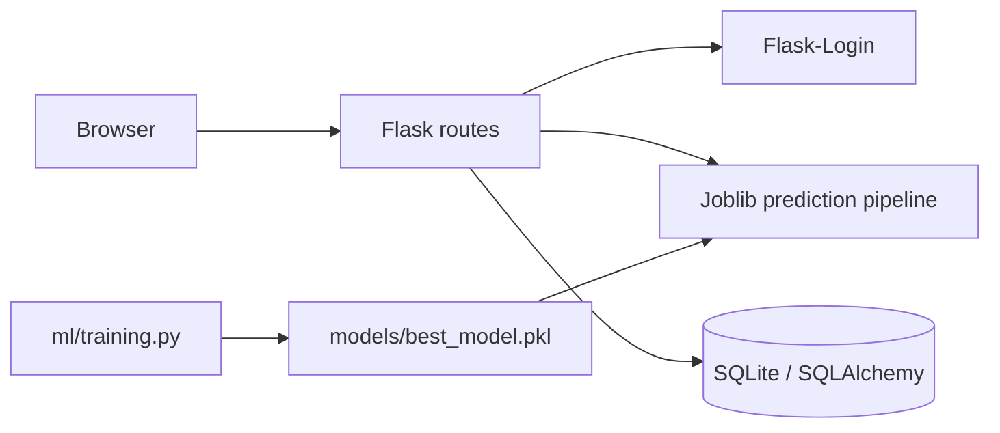

# System architecture

The training pipeline cleans duplicate rows, uses median/most-frequent imputation, one-hot encodes categories, scales numeric features, performs stratified splitting and cross-validation, compares four classifiers, and saves the best ROC-AUC artifact.
