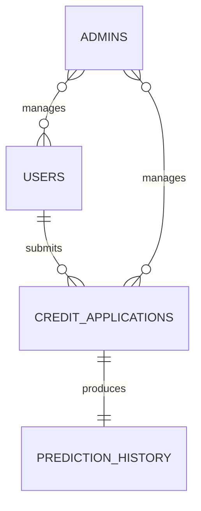

# Entity relationship diagram

```mermaid
erDiagram
  USERS ||--o{ CREDIT_APPLICATIONS : submits
  CREDIT_APPLICATIONS ||--|| PREDICTION_HISTORY : produces
  ADMINS }o--o{ USERS : manages
  ADMINS }o--o{ CREDIT_APPLICATIONS : manages
```

`Admin` management is an authorization relationship rather than a required foreign key: administrators may manage every user and application.
